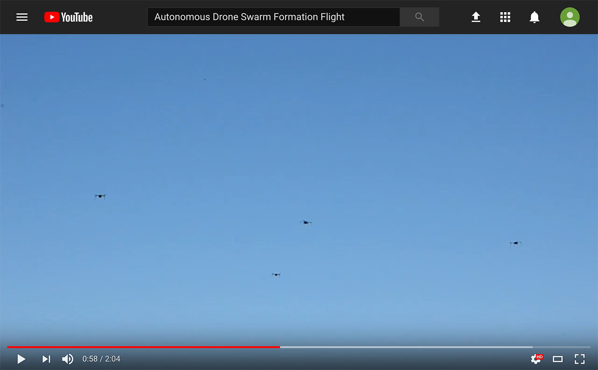
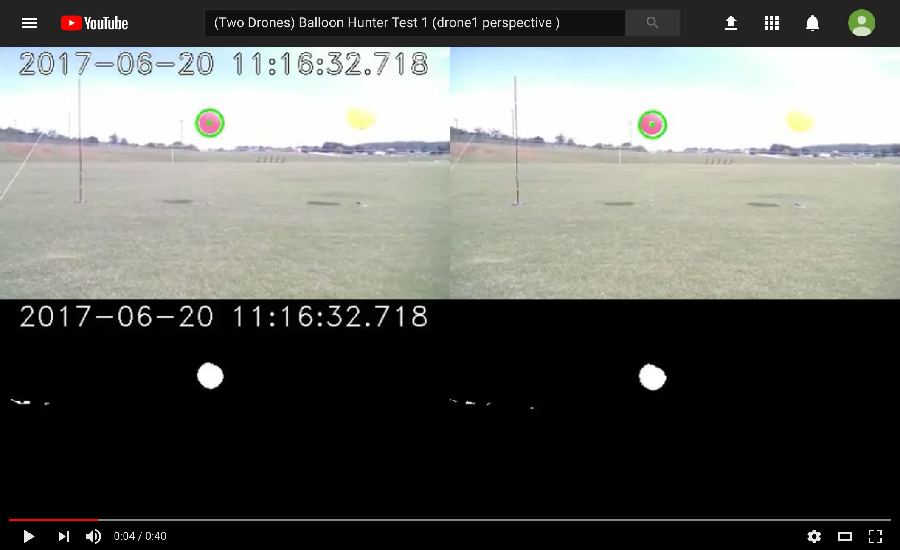
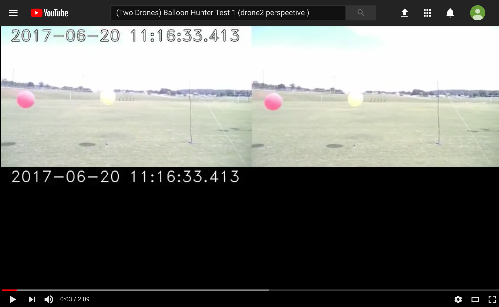
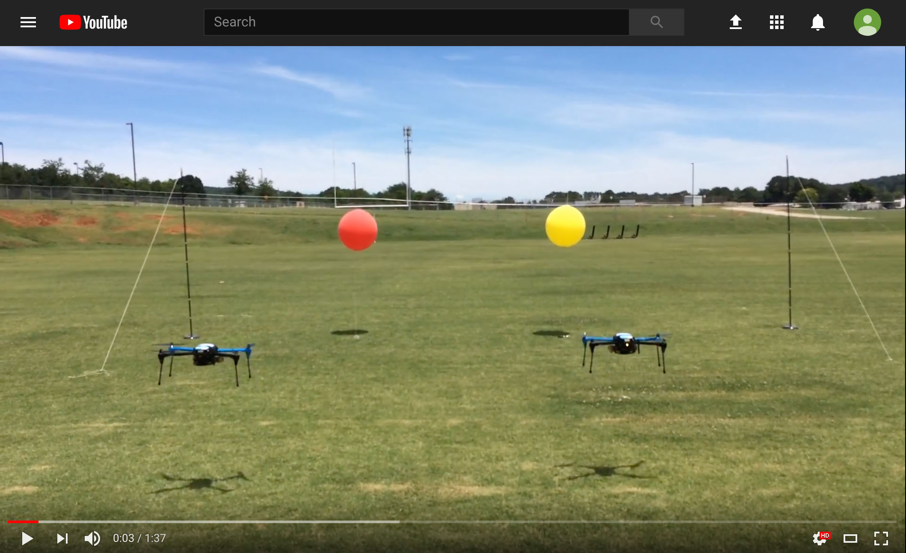
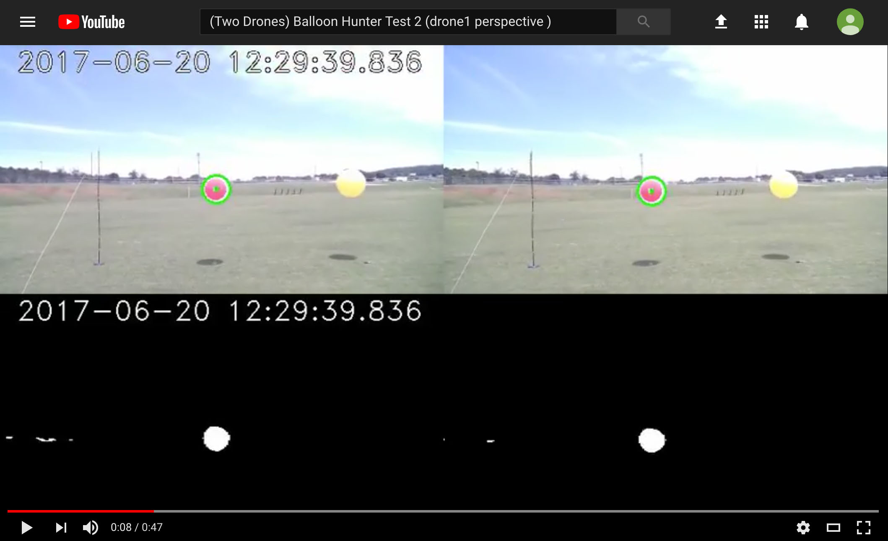
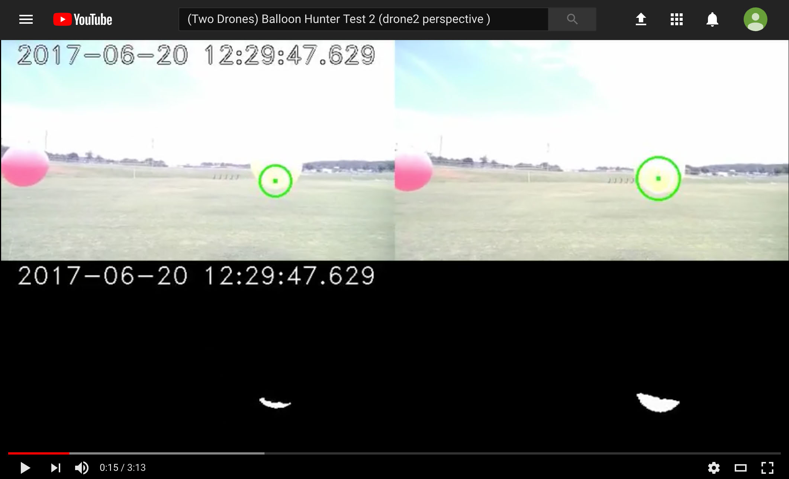
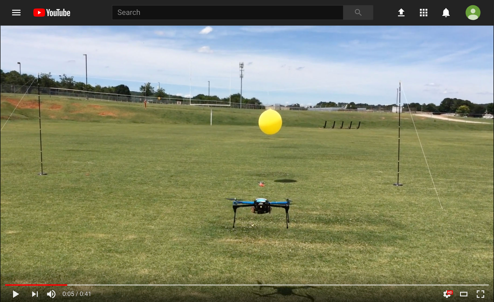

# Autonomous UAVs Swarm Mission

## 1. DESCRIPTON
This is an autonomous quadcopter swarm project. The purpose of this project is to achieve a designated mission by multiple drone cooperation. I developed and assembled two sets of the drone as the hardware platform. One set consists of six drones modified from 3DR IRIS+ drone, the other set consists of four drones made from scratch. I also developed a drone swarm control software package, including the functions of flight control, multi-drone communication, multi-drone coordination, stereo vision, failure handle, and so on.

There are three subprojects in this repository. 1) The Drone_Matrix_Formation_Flight is the earliest developed subproject, which achieves four drones formation flight. Four drones can form any formation dynamically in flight. This drone swarm can be easily expanded, i.e., you can add more drones to this troop. 2) The Drone_Matrix_Curvature_Flight subject is developed based on Drone_Matrix_Formation_Flight. This is an improved version of Drone_Matrix_Formation_Flight, in which the functions are modularized and more functions are added. The drone troop achieves curved path flight by specified curvature radius and degrees. An execution queue is implemented to achieve complex path designation. 3) Drone_Matrix_Balloon_Hunter is the latest developed subproject. It is developed based on Drone_Matrix_Curvature_Flight, with lots of more function added. In this project, four drones cooperate to find and destroy four balloons. The four balloons are in four different colors, and each drone is intended to find the ballon with specified color and then destroy it. The advanced stereo vision camera plus sonar system is designed and equipped on each drone. With this stereo vision system, the drone is able to find the ballon and calculate the distance of the ballon. Then the drone can adjust its heading and altitude to lock the balloon.

For all the three subprojects, there is one drone acts as a leader (commander), and the other drones act as followers (soldiers). The leader drone plans the mission and sends real-time commands to all the follower drones, and the follower drones carry out required actions following the leader's instructions. All the drones in the troop are identical, which makes the decentralized swarm structure feasible. With a proper negotiation strategy, it is easy to reassign the leader drone. The mission is still achievable by other drones even if the leader fails.


## 2. HARDWARE CONFIGURATION
### 1) DRONE SWARM SET I: MODIFIED 3DR IRIS+ DRONE
#### a) MECHANICAL SYSTEM
This Drone platform is modified from 3DR iris+ drone, and the mechanical system is unchange. Pleas refer to the official [3DR Operation Manual](Hardware_Configuration/3DR_IRIS/DOCS/IRIS-Plus-Operation-Manual-vH-web.pdf) for the hardware details. Following is the basic hardware spacification of the mechanical system:
```
- UAV Type: QuadCopter
- Frame Type: V
- Motors: 950 kV
- Propellers: 9.5 x 4.5 T-Motor multirotor self-tightening counterclockwise (2),
              9.5 x 4.5 T-Motor multirotor self-tightening clockwise (2)
- Battery: 3S 5.1 Ah 8C lithium polymer
```

<p align="center">
  
</p>

#### b) AUTOPILOT SYSTEM
The autopilot system shipped with iris+ drone is [Pixhawk](Hardware_Configuration/3DR_IRIS/README_PICS/Pixhawk.jpg) with firmware ArduCopter v3.2. I upgraded the firmeare to ArduCopter v3.3.3. All the software packages are tested with ArduCopter v3.3.3, and are guaranteed to work well. Please refer to [pixhawk official website](https://pixhawk.org) for details. The firmware is from ArduPilot open source project. Please refer to [ArduPilot official website](http://ardupilot.org/) for the introduction on this project and the instruction on how to flash firmeware and set parameters.
```
- Autopilot: Pixhawk 1
- Firmware: ArduCopter v3.3.3 (upgraded from original v3.2)
```

<p align="center">

</p>

#### c) POSITIONING SYSTEM
The 3DR iris+ drone is shipped with GPS. This project uses its original GPS.
```
- GPS: 3DR uBlox GPS with Compass (LEA-6H module, 5 Hz update)
```

#### d) ON BOARD COMPUTING SYSTEM (COMPANION COMPUTER)
This project need a high performance companion computer to do mission planning, computer vision task, and other computing-intensive tasks. However, the original iris+ done does not have a companion computer. After research, I found that the intel UP board is the best companion computer for this project. A [power module](Hardware_Configuration/3DR_IRIS/README_PICS/Power_module_5V_3A.jpg) is needed to power the companion computer.
```
- Single Board Computer: Intel UP board
- Processor: Intel® Atom™ x5-Z8350 Processor (2M Cache, up to 1.92 GHz),
             Quad Core CPU with 64 bit architecture
- Memory: 4GB DDR3L-1600
- Storage Capacity: 32 GB eMMC
- OS: Ubilinux
```

<p align="center">
  
</p>

#### e) STEREO VISION CAMERA AND SONAR SYSTEM
Original iris+ drone does not have any vision system. I designed and assembled the stereo vision camare to equipe it on each drone. Please refer to my other repository [Stereo_Vision_Camera](https://github.com/FlyingCatAlex/Stereo_Vision_Camera) for more detail. With stereo vision camera, drones are able to detect and locate objects in 3D frame. A [Maxbotix I2CXL-MaxSonar-EZ4 High Performance Sonar](https://www.maxbotix.com) is added to each iris+ drone for obstacle detection. The sonar sensor is installed in the center of the stereo vision camera. The solar sensor works with stereo vison camarea to locate objects accurately. 

<p align="center">

</p>

#### f) COMMUNICATION SYSTEM
Original iris+ drone is shipped with RC radio and 3DR radio. An operator can control iris+ maually with RC radio, or control it through ground station installed on computer with 3DR radio. In this project, the mission planning tasks are done by on board computer (companion computer), so there is no need to use a ground station. I removed the 3DR radio and reserve the telemetry port for on board computer. The port TELEM 2 on pixhawk is connected to companion computer via [USB to serial adapter](Hardware_Configuration/3DR_IRIS/README_PICS/USB_to_Serial_Adapter.jpg), and the port TELEM 1 on pixhawk is connected to RC radio receiver. Please refer to [this guide](http://ardupilot.org/dev/docs/odroid-via-mavlink.html) to hook up pixhawk with companion computer. The communication between drones are achieved via WiFi. The communication between drones is achieved by wifi via wireless router on ground. A [USB WiFi adapter](Hardware_Configuration/3DR_IRIS/README_PICS/Panda_Wireless_USB_WiFi_Adapter.jpg) is plugged to the usb port of companion computer to send and receive messages.
```
- Communication with Companion Computer: USB to serial port adapter
- Communication with Other Drones: Wifi via ground-based wireless router
- Manual Control: RC radio shipped with original 3DR iris+ drone
```

<p align="center">
  
</p>
<p align="center">
High Power Wireless Router (left) and USB WiFi Adapter (right)
</p>

#### g) FINAL PRODUCT
The following pictures show bottom view of the modified 3DR iris+ drone. In practical, a case covers on the companion computer to protect it from damage in case of crash, and the USB wifi adapter and USB to Serial adapter are fixed on each side of the companion computer.

<p align="center">
 
</p>

### 2) DRONE SWARM SET II: DRONE BIULT FROM SCRATCH BASED ON TAROT IONMAN 650 FRAME AND PIXHAWK2.1 AUTOPILOT
#### a) MECHANICAL SYSTEM
```
- UAV Type: QuadCopter
- Frame Type: X
- Frame Model: Tarot Iron Man 650 Carbon Fiber Fully Foldable Quadcopter Frame TL65B01
- Motor: Sunnysky X4110S 340KV
- Propeller: TAROT High Efficient Carbon Fiber Propeller 15x5.5 CW/CCW TL2812
- Electronic Speed Controller (ESC): ARRIS Simonk 30A 2-6S OPTO Brushless ESC
- Battery: Tattu Plus 10000mAh 22.2V 25C 6S1P Lipo Smart Battery
```

<p align="center">
  
</p>

#### b) AUTOPILOT SYSTEM
We use pixhawk 2.1 autopilot flight controller from [pixhawk open source hardware project](https://pixhawk.org/) and ArduCopter firmware from [ArduPilot open source autopilot project](http://ardupilot.org/).
```
- Autopilot: Pixhawk 2.1
- Firmware: ArduCopter v3.5
```

<p align="center">

</p>

#### c) POSITIONING SYSTEM
```
- GPS: Here GPS M8N & Compass Module for Pixhawk 2.1
```

#### d) ON BOARD COMPUTING SYSTEM (COMPANION COMPUTER)
[Intel UP Board](https://github.com/FlyingCatAlex/Autonomous_UAVs_Swarm_Mission/blob/master/README.md#d-on-board-computing-system-companion-computer). The same with modified 3DR iris+.

#### e) STEREO VISION CAMERA AND SONAR SYSTEM
[Stereo Vision Camera with Sonar Sensor](https://github.com/FlyingCatAlex/Autonomous_UAVs_Swarm_Mission/blob/master/README.md#e-stereo-vision-camera-and-sonar-system). The same with modified 3DR iris+.

#### f) 360 DEGREE LASER SCANNER (LIDAR)
```
Lidar Scanner: Sweep V1 360° Laser Scanner
```

<p align="center">

</p>

#### g) COMMUNICATION SYSTEM
The inter-drone communication method is the same with 3DR iris+. We use wifi for communication between drones. Please see [the description of communication system of 3DR iris+ drone](https://github.com/FlyingCatAlex/Autonomous_UAVs_Swarm_Mission/blob/master/README.md#f-communication-system) for details. 
```
- Communication with Companion Computer: USB to serial port adapter
- Communication with Other Drones: Wifi via ground-based wireless router
- Manual Control: FrSky Taranis X9D Plus Digital Telemetry Radio with X8R Telemetry Receiver
```

<p align="center">
  
</p>
<p align="center">
FrSky Taranis X9D Plus Digital Telemetry Radio (left) and X8R Telemetry Receiver (right)
</p>

#### h) FINAL PRODUCT

Following picture shows the assembled final product (without battery). The companion computer is mounted on bottom of the drone, And the battery will be mounted under the companion computer. 

<p align="center">
  
</p>

Below is the fully assembled four Tarot Iron Man 650 drones. It shows that all drones are armed and are waiting for next command from the companion computer.

<p align="center">
  
</p>

Below is the flight test. All drones work well. The flight time is more than 40 minutes per fully charge with all payload (Lidar, Stereo Vision Camera, Companion computer, and so on), which is sufficient for most missions. The flight time is much longer than most of other off-the-shelf products in market.

<p align="center">
  
</p>

## 3. SOFTWARE CONFIGURATION
### 1) CONFIGURE OS ENVIRONMENT
To work with drone, the companion computer should be able to start and login without password when power on. Also, to communicate with other drones via wifi, each computer need a static IP address. The flight control code should run automatically on boot. Please go through the procedures below to setup OS environment. (More details will be added when I get time :) )
```
- Install and setup LightDM to enable the companion computer auto login.
- Edit /etc/network/interfaces to assign a static IP address to each drone.
- Set the grub default boot entry, and set the grub timeout to 0.
- Edit /etc/rc.local to add the auto run item. (To avoid frequently modify this file, 
  you can write the path and name of an script, say run_on_boot.sh, in rc.local file, 
  then write all auto run items in run_on_boot.sh.)
```

### 2) INSTALL PACKAGES
We need openCV for stereo vision system, please follow the instruction below to compile and install openCV 3.1.
```
# This script install opencv 3.1.0 for python and other needed components. 
# This script is written according to the tutorial on pyimagesearch website.
# You can save this script as install_opencv3.1_UP_board.sh. Then run . install_opencv3.1_UP_board.sh as root.

# Step 1: Open up a terminal and update the apt-get  package manager followed by upgrading any pre-installed packages:
sudo apt-get -y update
sudo apt-get -y upgrade

# Step 2: Our environment is now all setup — we can proceed to change to our home directory, pull down OpenCV from GitHub, and checkout the 3.1.0  version:
cd ~
git clone https://github.com/Itseez/opencv.git
cd opencv
sudo git checkout 3.1.0

# we also need the opencv_contrib repo as well. Without this repository, we won’t have access to standard keypoint detectors and local invariant descriptors (such as SIFT, SURF, etc.) that were available in the OpenCV 2.4.X version. We’ll also be missing out on some of the newer OpenCV 3.0 features like text detection in natural images:
cd ~
git clone https://github.com/Itseez/opencv_contrib.git
cd opencv_contrib
sudo git checkout 3.1.0
# make sure that you checkout the same version for opencv_contrib  that you did for opencv  above, otherwise you could run into compilation errors.

# setup the build:
cd ~/opencv
mkdir build
cd build
cmake -D CMAKE_BUILD_TYPE=RELEASE \
	-D CMAKE_INSTALL_PREFIX=/usr/local \
	-D INSTALL_C_EXAMPLES=OFF \
	-D INSTALL_PYTHON_EXAMPLES=ON \
	-D OPENCV_EXTRA_MODULES_PATH=~/opencv_contrib/modules \
	-D BUILD_EXAMPLES=ON ..

# compile OpenCV: (The Intel UP board has a 4 core processer.)
make -j4

# Assuming that OpenCV compiled without error, you can now install it:
sudo make instal # OpenCV is installed in global environment.
sudo ldconfig

# To confirm your installation:
# python
#>>> import cv2
#>>> cv2.__version__
#'3.1.0'
```

The following python packages will be used for flight control, mission planning, and object detection:
```
- ppenCV 3.1
- openssh-server
- openssh-client
- numpy
- matplotlib
- dronekit
- pymavlink
- mavproxy
- netifaces
- geopy
```

Besides these, we need several developer tools and other support tools. Please run the following command to install necessary packages:

```
# Set up companion computer
# Run it in root terminal, install everything under /root folder. 
# You can save this script as setup_UP_board.sh. Then run . setup_UP_board.sh as root.

# First of all update apt-get
sudo apt-get -y update
sudo apt-get -y upgrade

#a) Install some neccessary packages.
#   1) Install SSH server and client.
sudo apt-get install -y openssh-server
sudo apt-get install -y openssh-client
#   2) Install pip, a Python package manager.
wget https://bootstrap.pypa.io/get-pip.py
sudo -H python get-pip.py
#   3) Install virtualenv.
#sudo -H pip install virtualenv
#sudo rm -rf ~/.cache/pip
#   4) Install developer tools and gedit.
sudo apt-get install -y build-essential
sudo apt-get install -y cmake
sudo apt-get install -y git
sudo apt-get install -y pkg-config
sudo apt-get install -y gedit
#   5) OpenCV needs to be able to load various image file formats from disk, including JPEG, PNG, TIFF, etc. In order to load these image formats from disk, we’ll need our image I/O packages。
sudo apt-get install -y libjpeg8-dev
sudo apt-get install -y libtiff5-dev
sudo apt-get install -y libjasper-dev
sudo apt-get install -y libpng12-dev
#   6）Install the GTK development library, which the highgui module of OpenCV depends on to guild Graphical User Interfaces (GUIs). With this we are able to display the actual image to our screen.
sudo apt-get install -y libgtk2.0-dev
#   7) Install packages to process video streams and access individual frames.
sudo apt-get install -y libavcodec-dev
sudo apt-get install -y libavformat-dev
sudo apt-get install -y libswscale-dev
sudo apt-get install -y libv4l-dev
#   8) Install libraries that are used to optimize various routines inside of OpenCV:
sudo apt-get install -y libatlas-base-dev
sudo apt-get install -y gfortran
#   9) Install some other needed packages.
sudo apt-get install -y python2.7-dev
sudo apt-get install -y python-matplotlib
sudo apt-get inatall -y python-wxgtk3.0
sudo apt-get install -y libxml2-dev
sudo apt-get install -y libxslt-dev

#b) Install numpy.
sudo -H pip install numpy

#c) Install matplotlib.
sudo -H pip install matplotlib

#d) Install dronekit
#   1) Install dronekit.
sudo -H pip install dronekit
#pip install dronekit-sitl # dronekit-sitl is optional. For simulation.
#   2) Then, we need mavlink packages.
sudo -H pip install pymavlink
sudo -H pip install mavproxy

#e) Install exFAT support
sudo apt-get install exfat-fuse exfat-utils

#f) Install JAVA JRE/JDK
#First, update the package index:
sudo apt-get update
#Then, check if Java is not already installed:
#java -version
#If it returns "The program java can be found in the following packages", Java hasn't been installed yet, so execute the following command:
sudo apt-get install -y default-jre
#This will install the Java Runtime Environment (JRE). If you instead need the Java Development Kit (JDK), which is usually needed to compile Java applications (for example Apache Ant, Apache Maven, Eclipse and IntelliJ IDEA execute the following command:
sudo apt-get install -y default-jdk

#g) Install geopy (GPS API)
sudo pip install geopy

#h) Install netifaces
sudo pip install netifaces

#Done with software installation.
```

## 4. SOFTWARE ARCHITECHTURE

As mentioned in [DESCRIPTION](https://github.com/FlyingCatAlex/Autonomous_UAVs_Swarm_Mission/blob/master/README.md#1-descripton), there are three subprojects in the repository. Technically, they are three different developemt phases of one project. The objective of the entire project is to develope a autonomous drone swarm platform to performe designated multi-drone coorperation missions. This platform including hardwares and softwares. During the early development phase, the maily objective is to assure the feasibility of the system design. I performed intensive hardware and software test while develop [Drone_Matrix_Formation_Flight](Drone_Matrix_Formation_Flight/) and [Drone_Matrix_Curvature_Flight](Drone_Matrix_Curvature_Flight/). All the components of the system work properly. The [Drone_Matrix_Balloon_Hunter](Drone_Matrix_Balloon_Hunter/) subproject is the final product. The balloon hunter mission can be considered as a demonstration.

1. [Drone_Matrix_Formation_Flight](Drone_Matrix_Formation_Flight/) is the firstly developed code set. Its architecture is very simple:
  - [formation_main_leader.py](Drone_Matrix_Formation_Flight/formation_main_leader.py) is the main function for the leader drone. The mission is planed in this code. This code also coordinates all drones in a mission. The client and server services start on boot, to send commands to and receive status reports from the follower drones.
  - [formation_main_follower.py](Drone_Matrix_Formation_Flight/formation_main_follower.py) is the main function for the follower code. It starts the client and server services on the follower drone. All the things that follower drones do are receiving and executing the commands from leader drone, and send their own status to the leader drone on demand.
  - [formation_function.py](Drone_Matrix_Formation_Flight/formation_function.py) is the shared code for both leader and follower drones. All the functions which may be called by leader drone or follower drone are in this code.

2. [Drone_Matrix_Curvature_Flight](Drone_Matrix_Curvature_Flight/) is a improved version based on [Drone_Matrix_Formation_Flight](Drone_Matrix_Formation_Flight/). In this subproject, some new functions are added to achieve more complicated flight track. An execution queue is implemented to store the movement commands. The architechture is similar to its predecessor's.
  - [curvature_flight_main_leader.py](Drone_Matrix_Curvature_Flight/curvature_flight_main_leader.py) is similar to [formation_main_leader.py](Drone_Matrix_Formation_Flight/formation_main_leader.py)
  - [curvature_flight_main_follower.py](Drone_Matrix_Curvature_Flight/curvature_flight_main_follower.py) is similar to [formation_main_follower.py](Drone_Matrix_Formation_Flight/formation_main_follower.py)
  - [curvature_flight_function.py](Drone_Matrix_Curvature_Flight/curvature_flight_function.py) is similar to [formation_function.py](Drone_Matrix_Formation_Flight/formation_function.py)

3. [Drone_Matrix_Balloon_Hunter](Drone_Matrix_Balloon_Hunter/) is the final version of this project. Though its name is balloon hunter, it is able to execute all missions completed by [Drone_Matrix_Formation_Flight](Drone_Matrix_Formation_Flight/) and [Drone_Matrix_Curvature_Flight](Drone_Matrix_Curvature_Flight/). The stereo vision system is implemented, which enables the drone troop to perform more complicated missions involving object detection and recognition requirement.

  - [balloon_finder_leader.py](Drone_Matrix_Balloon_Hunter/balloon_finder_leader.py) is the main function runs on the leader drone.
  - [balloon_finder_follower.py](Drone_Matrix_Balloon_Hunter/balloon_finder_follower.py) is the main function runs on the follower drones.
  - [MyPythonModule](Drone_Matrix_Balloon_Hunter/MyPythonModule/) - A module used by both leader drone and follower drones. All functions are in this module.  
    - [DroneControlFunction.py](Drone_Matrix_Balloon_Hunter/MyPythonModule/DroneControlFunction.py) is drone control functions.
    - [ObjectDetection.py](Drone_Matrix_Balloon_Hunter/MyPythonModule/ObjectDetection.py) is stereo vision and object detection functions.
    - [v4l2.py](Drone_Matrix_Balloon_Hunter/MyPythonModule/v4l2.py) is video for linux 2 (v4l2) device python API.
    - [v4l2_device.py](Drone_Matrix_Balloon_Hunter/MyPythonModule/v4l2_device.py) is stereo vision camera device class.

## 5. SAFETY FEATURES
### 1) FEATURED BY ARDUPILOT FIRMWARE
- Automatically return to launch point when voltage is low.
- Automatically return to launch point when GPS signal lost.
- Automatically return to launch point when Radio controller signal lost.

### 2) FEATURED BY THIS PROJECT
- Automatically return to launch point when wifi signal lost.
- Realtime flight log. This is a [sample log](Drone_Matrix_Formation_Flight/DOCS/FlightLog_iris1_20161031_16-59-55.txt).
- Collision avoidance using stereo vision camera and sonar. (To be done)
- Collision avoidance using 360 rotating scanner lidar. (To be done)

## 6. ADVANCED FEATURES
The hardware platform enable us to do more advance missions. However, the software is to be developled.
- SLAM
- Auto Formation and Re-configuration

## 7. MISSIONS
### 1) FORMATION FLIGHT
#### OBJECTIVE
Drone troop flys in specified formations. Change formation in flight.

Drone swarm set: Modified 3DR iris+ drones

Actions:
1. All drones self-arm. Leader check the status of all follower drones. Take off when all drones are ready.
2. Take off in square formation.
3. Change formation from square to diamond while flying forward.
4. Change formation from diamond to triangle while flying forward.
5. Leader drone commands all follower drones go home. When all the follower drones land on launch point, leader drone go home.

#### RESULT

<p align="center">
  
</p>

<p align="left">
Square formation (left), diamond formation (middle), and triangle formation (right). The arrow indicates the flight direction.
</p>

Video (Click on picture to watch in Youtube):

[](https://youtu.be/soto34wwzAU)


### 2) CURVATUR FLIGHT
#### OBJECTIVE
Formation flight along complicated curved path.

Drone swarm set: Modified 3DR iris+ drones

Actions: Tested triangle and square formation flight in "O" shape and "8" shape loop.

#### RESULT
Works great. Drone swarm is able to execute complicated curved path flight. Videos to be uploaded.

### 3) BALLOON HUNTER
#### OBJECTIVE
Find the balloons with specified color and destroy them. 

Drone swarm set: Modified 3DR iris+ drones

Actions:
Assign a target for each drone by color. All drones find and destroy their designated balloons. The leader drone coordinate the entire action. When all drones are ready to take off, leader drone commands follower drones take off. When all drones complete mission or timeout, leader drone commands follower drones return to launch point.

#### RESULT

##### 1. TWO DRONES TEST
###### TEST 1
Iris1 (the leader) found the red balloon and try to hit into it, but its propeller was wrapped by the rope that hung the balloon. Iris2 (the follower) did not find the yellow balloon. The reason is that the yellow color is not detected.

Third-person perspective video:

(Click on picture to watch in Youtube)

[](https://youtu.be/_SyWTcQs5Js)

---

First-person perspective video (shot by the vision system on iris1 drone): 

(Click on picture to watch in Youtube)

[](https://youtu.be/CnQ-mRdKBgw)

---

First-person perspective video (shot by the vision system on iris2 drone): 

(Click on picture to watch in Youtube)

[](https://youtu.be/w-P8jq9A6hY)

---
---

###### TEST 2
Two drone balloon hunter mission test. Iris1 (the leader) found the red balloon and destroyed it successfully. Iris2 (the follower) detected the yellow balloon but finally missed it. The yellow color is detected this time, but the exposure is not appropriate, which casue only part of the yellow balloon is recognized. This cause the vision-detected result not stable. The iris2 drone finally missed the yellow balloon.

(Click on picture to watch in Youtube)

[](https://youtu.be/y370Tdfmgqc)

---

First-person perspective video (shot by the vision system on iris1 drone): 

(Click on picture to watch in Youtube)

[](https://youtu.be/TAhvWtGgZGE)

---

First-person perspective video (shot by the vision system on iris2 drone): 

(Click on picture to watch in Youtube)

[](https://youtu.be/GFtfS8gO6sw)

---
---

###### TEST 3
The red balloon has been destroyed by iris1 in test2. This time, we let iris2 performed the task by itself. We adjusted the exposure of the vision system on iris2. It found and destroyed the yellow balloon.

Third-person perspective video:

(Click on picture to watch in Youtube)

[](https://youtu.be/cJzzUwu1KwM)

---

First-person perspective video (shot by the vision system on iris2 drone):

(Click on picture to watch in Youtube)

[](https://youtu.be/TaKmQ_e6p-c)

```
  
  
```

##### 2. FOUR DRONES TEST
Four drones were programed to find four balloons with different colors and destroy them. Iris1's target is the red balloon; iris2's target is the yellow balloon; iris3's target is the black balloon; iris4's target is the blue balloon. Iris1 found its target and destroyed it. Iris2 detected its target, but can not confirm it. It failed to destroy it's target. The dark cloud confused iris3, and iris3 failed to detect the black balloon. Iris4 detected its target, the blue balloon at first, but cannot confirm it. Finally iris4 lost it's target. 

<p align="center">

</p>

First-person perspective video (shot by the vision system on iris1 drone):

(Click on picture to watch in Youtube)

[](https://youtu.be/TaKmQ_e6p-c)

---


